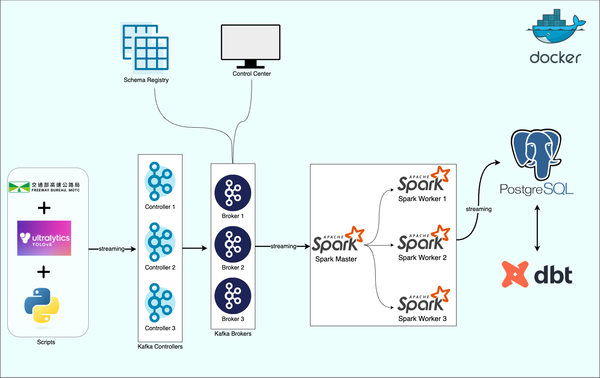

# Highway Traffic Data Engineering Platform



## Overview

This project is a data engineering platform for highway traffic analysis. It integrates real-time object detection (YOLO), Kafka streaming, Spark processing, and a PostgreSQL data warehouse, with dbt for analytics and transformation. The system is containerized using Docker Compose for easy deployment and scalability.

## Architecture

- **YOLO Object Detection**: Detects vehicles from video streams and publishes detection results to Kafka.
- **Kafka**: Serves as the message broker for real-time streaming data.
- **Spark Structured Streaming**: Consumes data from Kafka, processes and writes to PostgreSQL.
- **PostgreSQL**: Stores raw and processed traffic data.
- **dbt**: Manages data transformation and analytics in the data warehouse.

## Directory Structure

```
.
├── dbt_highway_psql/      # dbt project for data warehouse modeling
├── scripts/               # Data processing and YOLO scripts
├── Dockerfile             # Main service Dockerfile
├── Dockerfile.spark       # Spark Dockerfile
├── docker-compose.yml     # Multi-service orchestration
├── requirements.txt       # Python dependencies
└── README.md              # Project documentation
```

## Installation

1. **Clone the repository**

   ```bash
   git clone --filter=blob:none --no-checkout https://github.com/PoChaoWang/pochao_profile.git
   cd pochao_profile
   git sparse-checkout init --cone
   git sparse-checkout set data_engineering/highway_traffic
   cd data_engineering/highway_traffic
   ```

2. **Install Docker and Docker Compose**

   - For macOS:
     ```bash
     brew install docker docker-compose
     ```
   - For Ubuntu:
     ```bash
     sudo apt-get update
     sudo apt-get install docker.io docker-compose
     ```

3. **Build and start all services**

   ```bash
   docker-compose up -d
   ```

4. **Run Services**

   a. In Docker Desktop, open the terminal of main_service container and run:

   ```bash
   python scripts/yolo_script.py
   ```

   b. In your local terminal, execute the Spark script:

   ```bash
   docker-compose exec spark-master /opt/bitnami/spark/bin/spark-submit \
     --master spark://spark-master:7077 \
     --packages org.apache.spark:spark-sql-kafka-0-10_2.12:3.5.0,org.postgresql:postgresql:42.7.3 \
     /opt/bitnami/spark/scripts/spark_script.py
   ```

   c. Run dbt transformations:

   ```bash
   docker-compose run --rm dbt run
   ```

   After completing these steps, the system will:

   - Detect vehicles from video streams
   - Send detection results to Kafka
   - Process data with Spark and write to PostgreSQL
   - Transform and analyze data with dbt

## Local Development

For local development and testing of YOLO detection (without data transmission), you can use `yolo_local.py`. This allows you to see the detection visualization which is disabled in the Docker environment.

### Key Differences Between yolo_local.py and yolo_script.py

The main difference between these two scripts is that `yolo_local.py` includes visualization features that are disabled in `yolo_script.py`:

- `yolo_script.py` (Docker version):

  - KAFKA_BROKERS = "kafka-broker-1:9092"
  - Runs in a headless environment
  - Visualization functions (`cv2.imshow`, `cv2.waitKey`, `cv2.destroyAllWindows`) are commented out
  - Designed for production use in Docker containers
  - Focuses on data processing and transmission

- `yolo_local.py` (Local version):
  - KAFKA_BROKERS = "127.0.0.1:9092"
  - Includes all visualization features
  - Shows real-time detection windows
  - Allows interactive testing and debugging
  - Better for development and testing purposes

### Prerequisites

1. **Install Python Dependencies**

   ```bash
   pip install --no-cache-dir -r requirements.txt
   ```

2. **Download Kafka**
   - Visit [Kafka Downloads](https://kafka.apache.org/downloads)
   - Download `kafka_2.13-3.9.0`
   - Extract the downloaded file

### Running Kafka Locally

#### macOS/Linux

1. Start Zookeeper:

   ```bash
   cd kafka_2.13-3.9.0
   bin/zookeeper-server-start.sh config/zookeeper.properties
   ```

2. In a new terminal, start Kafka:
   ```bash
   cd kafka_2.13-3.9.0
   bin/kafka-server-start.sh config/server.properties
   ```

#### Windows

1. Start Zookeeper:

   ```bash
   cd kafka_2.13-3.9.0
   bin\windows\zookeeper-server-start.bat config\zookeeper.properties
   ```

2. In a new terminal, start Kafka:
   ```bash
   cd kafka_2.13-3.9.0
   bin\windows\kafka-server-start.bat config\server.properties
   ```

### Running YOLO Locally

Once Kafka is running, execute the local YOLO script:

```bash
python scripts/yolo_local.py
```

Note: This setup is for development and testing purposes only. For production use, it's recommended to run the system using Docker as described in the Installation section.

## Data Flow

1. **YOLO Detection** (`scripts/yolo_script.py`):

   - Captures video frames, runs YOLOv8 object detection, and sends detection results (vehicle type, bounding box, speed, etc.) to a Kafka topic.

2. **Kafka**:

   - Receives and buffers detection messages for downstream consumers.

3. **Spark Streaming** (`scripts/spark_script.py`):

   - Reads detection data from Kafka, parses and transforms it, and writes to a PostgreSQL table (`highway_traffic_raw`).

4. **PostgreSQL**:

   - Stores raw detection data for further analysis.

5. **dbt** (`dbt_highway_psql/`):
   - Performs data modeling, transformation, and analytics on the stored data.

## Configuration

- **Kafka**: Configured in `docker-compose.yml` and scripts.
  - By default, the system uses 1 controller and 1 broker for lower resource consumption.
  - To scale up to 3 controllers and 3 brokers:
    1. In `docker-compose.yml`, uncomment the following sections:
       - Remove comments from `kafka-controller-2`, `kafka-controller-3`, `kafka-broker-2`, and `kafka-broker-3` services
       - Update `KAFKA_CONTROLLER_QUORUM_VOTERS` to include all controllers:
         ```
         KAFKA_CONTROLLER_QUORUM_VOTERS: 1@kafka-controller-1:9093,2@kafka-controller-2:9093,3@kafka-controller-3:9093
         ```
       - Update `SCHEMA_REGISTRY_KAFKASTORE_BOOTSTRAP_SERVERS` to include all brokers:
         ```
         SCHEMA_REGISTRY_KAFKASTORE_BOOTSTRAP_SERVERS: PLAINTEXT://kafka-broker-1:9092,PLAINTEXT://kafka-broker-2:9092,PLAINTEXT://kafka-broker-3:9092
         ```
       - Update `KAFKA_BROKERS` in the console service:
         ```
         KAFKA_BROKERS=kafka-broker-1:9092,kafka-broker-2:9092,kafka-broker-3:9092
         ```
       - Uncomment all broker and controller volumes:
         ```
         volumes:
           postgres_data:
           broker_data_1:
           broker_data_2:
           broker_data_3:
           controller_data_1:
           controller_data_2:
           controller_data_3:
         ```
    2. Update Kafka broker configuration in scripts:
       - In `scripts/yolo_script.py`, uncomment and update the KAFKA_BROKERS:
         ```python
         KAFKA_BROKERS = "kafka-broker-1:9092,kafka-broker-2:9092,kafka-broker-3:9092"
         ```
       - In `scripts/spark_script.py`, uncomment and update the kafka_bootstrap_servers:
         ```python
         kafka_bootstrap_servers = "kafka-broker-1:9092,kafka-broker-2:9092,kafka-broker-3:9092"
         ```
    3. Note: Running 3 controllers and 3 brokers requires significant system resources. Ensure your system meets the requirements before scaling up.
- **YOLO Model**: Place your YOLOv8 model weights (`yolov8s.pt`) in the `scripts/` directory.
- **Speed Zones**: Configure in `scripts/speed_zones_config.json`.
- **Database**: Connection parameters are set via environment variables or `.env` files.

## Location Configuration

The system currently supports two predefined locations: "Zonghe" and "Linkou". To change the location or add a new one:

### Changing Location

1. Open `scripts/yolo_script.py`
2. Locate the main section:

   ```python
   if __name__ == "__main__":
       Zonghe = "Zonghe"  # Or choose "Linkou"

       try:
           if initialize_kafka():
               logging.info("Kafka initialization process succeeded.")

               if is_kafka_ready():
                   yolo_processing_main(Zonghe)
   ```

3. To switch to Linkou, modify the code to:

   ```python
   if __name__ == "__main__":
       Linkou = "Linkou"

       try:
           if initialize_kafka():
               logging.info("Kafka initialization process succeeded.")

               if is_kafka_ready():
                   yolo_processing_main(Linkou)
   ```

### Adding New Location

To add a new location:

1. Open `scripts/speed_zones_config.json`
2. Add a new location configuration after the existing ones:
   ```json
   "Your Zone Name": {
       "BASE_VIDEO_URL": "your_mjpg_stream_url",
       "SPEED_ZONES": [
           {
               "name": "zone name",
               "line1_points": [[x1, y1], [x2, y2]],
               "line2_points": [[x3, y3], [x4, y4]],
               "real_length_meters": 0.0,
               "line1_color": [0, 0, 255],
               "line2_color": [0, 165, 255]
           }
       ]
   }
   ```

Important notes for new locations:

- Ensure the `BASE_VIDEO_URL` is a valid MJPEG stream URL
- For `line1_points` and `line2_points`, use road markings (like dashed lines or cat's eyes) as reference points
- Calculate `real_length_meters` based on road markings:
  - Taiwan highway dashed lines: 4 meters per line, 6 meters gap between lines
  - Use these measurements to calculate the actual distance between line1 and line2
- If you want to use Taiwan highway live camera feeds, you can find stream URLs for different sections from the [Highway Bureau 1968 Service Website](https://www.1968services.tw/)

## Main Dependencies

See `requirements.txt` for the full list. Key packages:

- `ultralytics`, `torch`, `opencv-python` (YOLO & image processing)
- `confluent-kafka`, `kafka-python` (Kafka integration)
- `pyspark` (Spark streaming)
- `psycopg2-binary` (PostgreSQL)
- `dbt-core`, `dbt-postgres` (Data transformation)

## Usage

- **Run all services**:  
  `docker-compose up -d`
- **Check logs**:  
  Logs are stored in the `logs/` directory.
- **dbt commands**:  
  See `dbt_highway_psql/README.md` for dbt usage.

## References

- [dbt Documentation](https://docs.getdbt.com/docs/introduction)
- [YOLO by Ultralytics](https://docs.ultralytics.com/)
- [Apache Kafka](https://kafka.apache.org/)
- [Apache Spark](https://spark.apache.org/)
